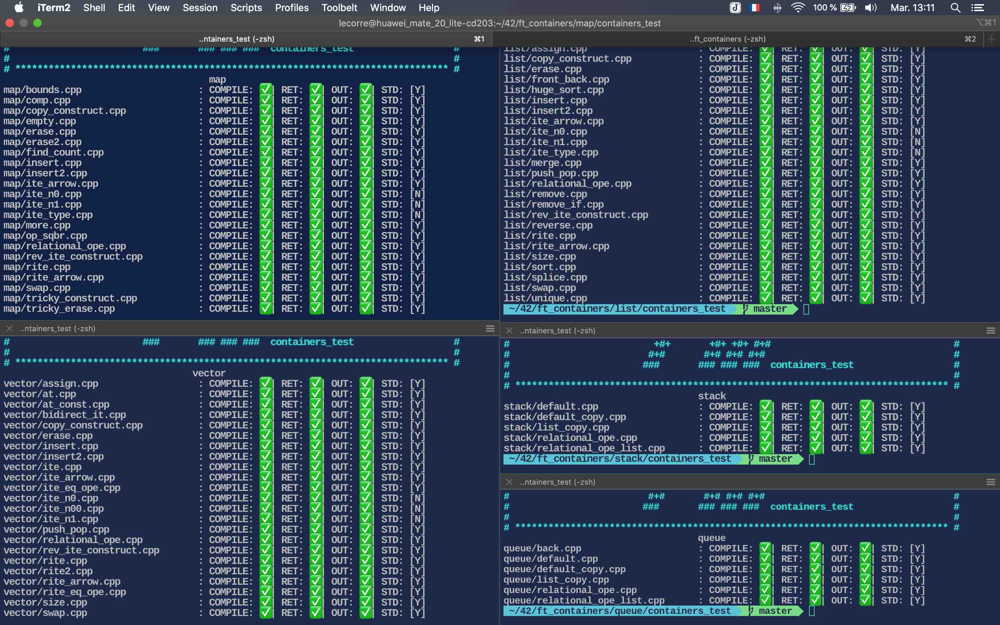
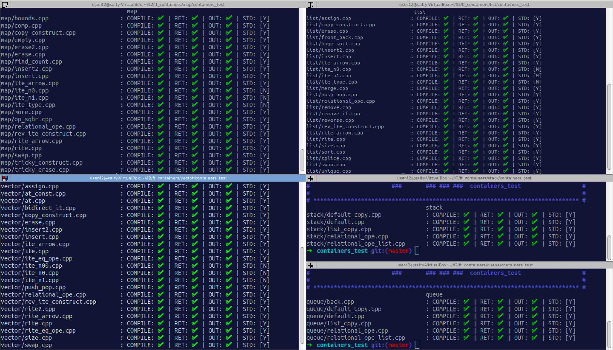

# Description

Implementation of STL containers: vector, list, map, stack, queue & iterators_traits, reverse_iterator, enable_if, is_integral, equal/lexicographical compare, std::pair, std::make_pair.

All memory allocation & deallocation, as well as construction & destruction, is made with the help of std::allocator.

iterator_traits are used with reverse_iterator & with distance method helper in ft::vector to optimize the distance algorithm (with help of iterator tags), as some member function use template iterator instead of internal ones.

ft::list is implemented with a doubly circular linked list.

ft::map is implemented with a non-balanced circular BST.

This project makes us explore the notions of templates & metaprogramming.

---
Results from this nice tester: - https://github.com/mli42/containers_test

osx:

ubuntu:

# Documentation :green_book:

- https://github.com/mli42/containers_test
- https://github.com/isocpp/CppCoreGuidelines/blob/master/CppCoreGuidelines.md#c-core-guidelines
- https://github.com/gcc-mirror/gcc
- https://github.com/Mazoise/FT_CONTAINERS_TESTER
- https://en.cppreference.com/w/cpp/links
- https://www.geeksforgeeks.org/containers-cpp-stl/
- https://www.geeksforgeeks.org/stdallocator-in-cpp-with-examples/
- https://www.geeksforgeeks.org/friend-class-function-cpp/
- https://www.geeksforgeeks.org/using-namespace-std-considered-bad-practice/?ref=rp
- https://www.geeksforgeeks.org/namespace-in-c/
- https://www.geeksforgeeks.org/inline-functions-cpp/
- https://cs.calvin.edu/activities/books/c++/intro/3e/WebItems/Ch14-Web/STL-List-14.4.pdf
- https://codefreakr.com/how-is-c-stl-implemented-internally/
- https://www.cs.helsinki.fi/u/tpkarkka/alglib/k06/lectures/containers.html
- https://www.cs.helsinki.fi/u/tpkarkka/alglib/k06/lectures/iterators.html
- https://en.cppreference.com/w/cpp/container/vector
- https://www.cplusplus.com/reference/list/list/
- https://www.cplusplus.com/reference/vector/vector/
- https://www.cplusplus.com/reference/map/map/
- https://www.cplusplus.com/reference/memory/allocator/
- https://cplusplus.com/reference/iterator/iterator/
- https://h-deb.clg.qc.ca/Sujets/Divers--cplusplus/Traits.html
- https://www.developpez.net/forums/d1864075/c-cpp/cpp/traits-cpp/
- https://h-deb.clg.qc.ca/Sujets/Divers--cplusplus/index.html
- https://fr.wikipedia.org/wiki/It%C3%A9rateur
- https://jonathanpoelen.github.io/
- https://jonathanpoelen.github.io/2020/04/sfinae/
- https://en.cppreference.com/w/cpp/language/sfinae
- https://en.wikipedia.org/wiki/Substitution_failure_is_not_an_error
- https://jonathanpoelen.github.io/2012/12/taguer-vos-classes-cataloguees-les/
- https://jonathanpoelen.github.io/2013/04/placement-new-allocateur-et-conteneur/
- https://cdn.discordapp.com/attachments/785407584608714802/796032192190611456/Diagramme_UML_de_STL.png
- http://www.lirmm.fr/~ducour/Doc-objets/ISO+IEC+14882-1998.pdf
- https://en.cppreference.com/w/cpp/types/enable_if
- https://www.geeksforgeeks.org/template-metaprogramming-in-c/
- https://www.geeksforgeeks.org/how-to-detect-operating-system-through-a-c-program/
- https://stackoverflow.com/questions/7555391/template-template-c-function
- https://blog.feabhas.com/2014/08/templates-of-templates/
- https://www.codeguru.com/cpp/cpp/cpp_mfc/general/article.php/c16465/About-sizet-and-ptrdifft.htm
- https://www.internalpointers.com/post/quick-primer-type-traits-modern-cpp
- https://alp.developpez.com/tutoriels/traitspolicies/
- https://dont.tech/2017/09/28/c-traits/
- https://stackoverflow.com/questions/25284499/how-does-stdenable-if-work
- https://riptutorial.com/cplusplus/example/3777/enable-if
- https://eli.thegreenplace.net/2014/sfinae-and-enable_if/
- https://www.cplusplus.com/reference/type_traits/enable_if/
- https://stackoverflow.com/questions/6292332/what-really-is-a-deque-in-stl
- https://www.bigocheatsheet.com/
- https://www.tutorialspoint.com/data_structures_algorithms/index.htm
- https://www.tutorialspoint.com/data_structures_algorithms/avl_tree_algorithm.htm
- https://cs.gmu.edu/~setia/cs310/slides/avl.pdf
- https://www.cs.usfca.edu/~galles/visualization/BST.html
- http://btv.melezinek.cz/binary-search-tree.html
- http://www.cs.fsu.edu/~lacher/courses/COP4530/lectures/binary_search_trees3/script.html
- https://courses.cs.vt.edu/~cs3114/Fall17/barnette/notes/Tree-Iterators.pdf
- https://stackoverflow.com/questions/9456937/when-to-use-preorder-postorder-and-inorder-binary-search-tree-traversal-strate
- https://www.geeksforgeeks.org/binary-search-tree-set-2-delete/
- https://medium.com/swlh/binary-search-trees-c-484377f0d349
- https://www.codesdope.com/course/data-structures-binary-search-trees/
- https://iq.opengenus.org/implement-binary-search-tree-in-cpp/
- https://www.javadevjournal.com/data-structure/binary-tree-traversal/
- https://stackoverflow.com/questions/5346890/what-is-the-difference-between-const-iterator-and-iterator
- https://isocpp.org/wiki/faq/templates
- https://stackoverflow.com/questions/6742008/what-are-the-typical-use-cases-of-an-iterator-trait
- https://loulou.developpez.com/tutoriels/cpp/metaprog/
- https://www.fluentcpp.com/2018/05/08/std-iterator-deprecated/
- https://www.codeproject.com/Articles/36530/An-Introduction-to-Iterator-Traits
- https://www.cs.uic.edu/~mcpc/STL_Docs/iterator_traits.html
- https://www.cs.uic.edu/~mcpc/STL_Docs/iterator_tags.html
- https://www.cs.uic.edu/~mcpc/STL_Docs/iterator_category.html
- https://alp.developpez.com/tutoriels/templaterebinding/
- https://www.codeproject.com/Articles/4795/C-Standard-Allocator-An-Introduction-and-Implement
- http://www.open-std.org/jtc1/sc22/wg21/docs/papers/2016/p0310r0.pdf
- https://www.bogotobogo.com/cplusplus/memoryallocation.php
- https://www.scs.stanford.edu/~dm/home/papers/c++-new.html
- https://stackoverflow.com/questions/14718055/what-is-the-difference-between-a-trait-and-a-policy
- http://www.cantrip.org/traits.html
